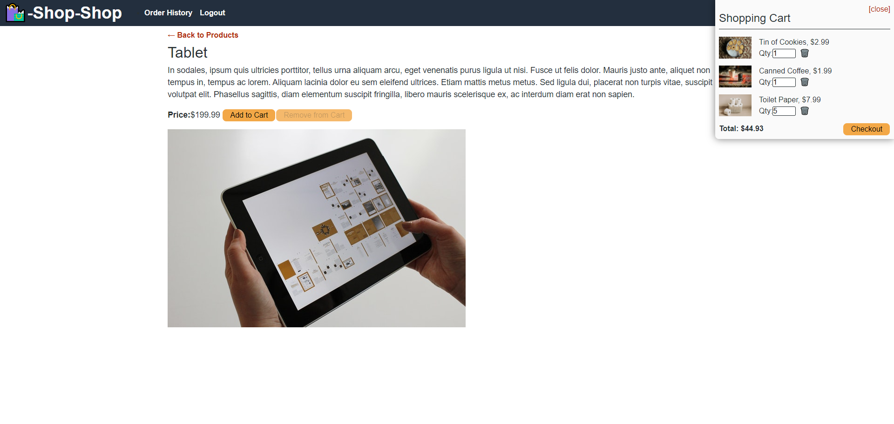
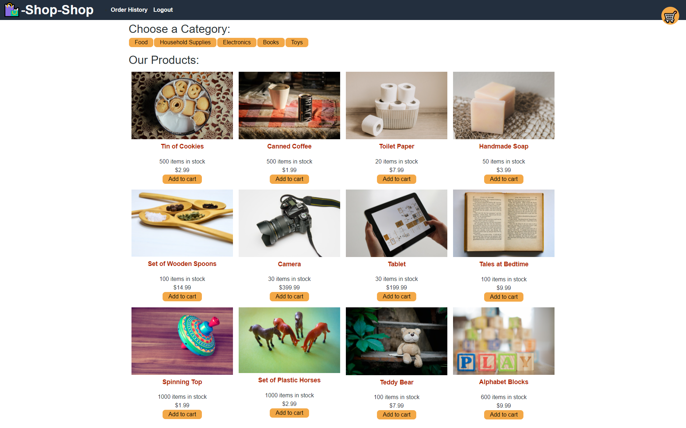
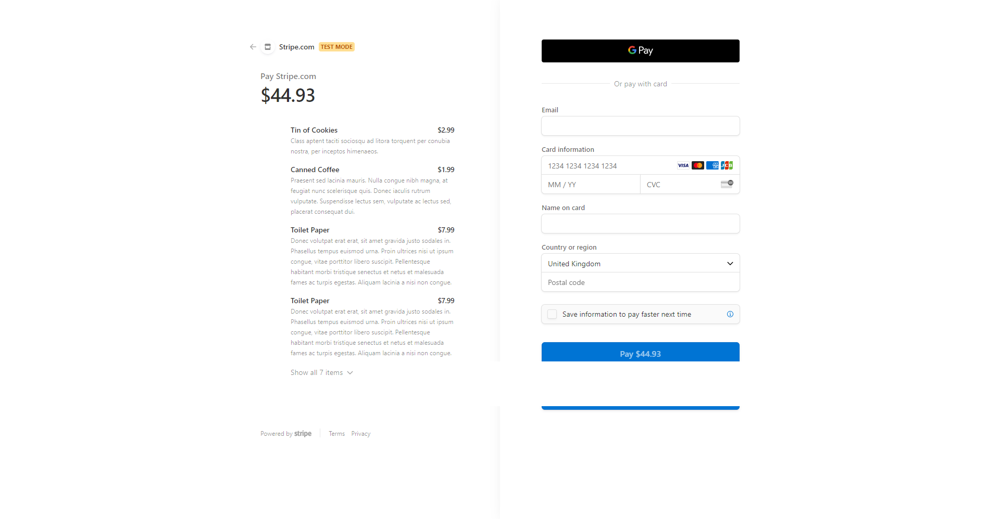

# E-Commerce Redux Shop

### Application Screenshot







### App Deployment

https://tranquil-beach-74651.herokuapp.com/

### Instructions

Download repo and;

```
cd server
npm i
npm i graphql
npm i redux
npm run seed
npm run watch
```

```
cd client
npm i
npm run start
```

### User Story

```text
AS a senior engineer working on an e-commerce platform
I WANT my platform to use Redux to manage global state instead of the Context API
SO THAT my website's state management is taken out of the React ecosystem
```

## Questions

If you have any questions regarding this app, please contact me via:

- Email at hakelcam@gmail.com
- GitHub at <https://github.com/Hakkelo89>
